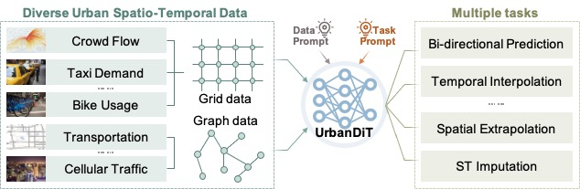
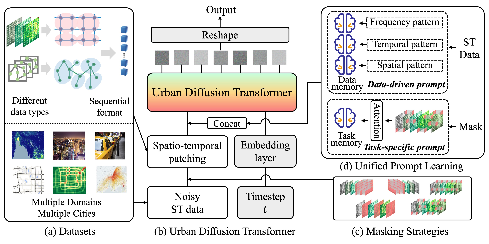

# UrbanDiT

A pytorch implementation for the paper: **UrbanDiT: A Foundation Model for Open-World Urban Spatio-Temporal Learning**.


-----

The repo currently includes code implementations for the following tasks:

> **Bi-Directional Prediction**

> **Temporal Interpolation**

> **Spatial Extrapolation**

> **Spatio-Temporal Imputation**


## Introduction
🏆 UrbanDiT offers three primary advantages: 1) It unifies diverse data types; 2) It supports a wide range of tasks; and 3) It generalizes effectively to open-world scenarios, with its powerful zero-shot capabilities.


## Overall Architecture
🌟 Illustration of the whole framework of UrbanDiT, including four key components: a) Unifying different urban spatio-temporal data types; b) The diffusion pipeline of our UrbanDiT; c) Different masking strategies to specify different tasks; d) Unified prompt learning with data-driven and task-specific prompts to enhance the denoising process.



## Data
We use multiple datasets to evaluate UrbanDiT, which span various cities and domains. To access the datasets, please refer to [data readme]().


## ⚙️ Installation
### Environment
- Tested OS: Linux
- Python >= 3.9
- torch == 2.0.0
- Tensorboard

### Dependencies:
1. Install Pytorch with the correct CUDA version.
2. Use the `pip install -r requirements.txt` command to install all of the Python modules and packages used in this project.

## 🏃 Model Training

Please first navigate to the `src` directory by using the cd command: `cd src`

Then please create a folder named `experiments` to record the training process: `mkdir experiments`

You can train UrbanDiT as the following examples:

```
python train_one_step.py --dataset your_training_dataset --batch_ratio 1.0 --norm_type standard --machine your_machine --time_patch 1 --stride 2 --t_patch_len 2  --is_prompt 1    --learning_rate 1e-4 --diffusion_steps 500 --num_inference_steps 20 --pred_len 12 --his_len 12
```

Once your model is trained, you will find the `./experiments/<experiment_name>/`, you will find the trained model named `model_best.pkl`.
